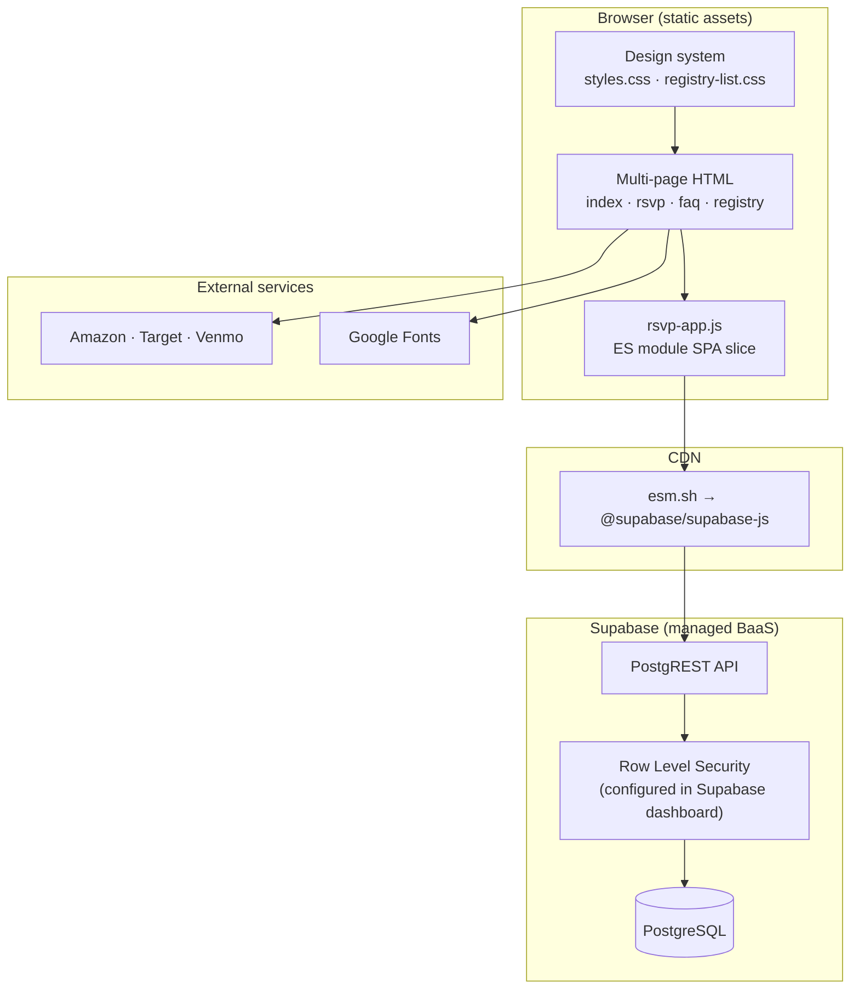

# Fornoff Wedding — Event Web Platform

Production wedding website for **Taylor Carlson & Connor Fornoff** (October 21, 2026 · Gather Estate, Mesa, AZ). The site serves as the single guest-facing channel for event information, registry discovery, and RSVP capture ahead of a hard **September 21, 2026** response deadline.

Built as a **static multi-page front end** with a **Supabase-backed RSVP subsystem**—no custom application server, no build pipeline for content pages, and no guest login flow. Guests identify themselves by name; responses persist in PostgreSQL via the Supabase/PostgREST API.

---

## Problem & impact

| Stakeholder need | How the system addresses it |
|------------------|-----------------------------|
| Guests need one place for date, venue, dress code, and FAQs | Structured content pages with semantic HTML, mobile layout, and accessible navigation |
| Couple needs headcount and dietary data for catering | Per-guest RSVP records with attendance boolean and free-text dietary field |
| Invitations are sent by **party** (household), not individual login | Party-centric data model; one lookup loads every guest on the invitation |
| Common names / partial name entry | Dual-index guest search plus client-side disambiguation UI |
| Registry spans multiple vendors | Curated outbound links (Amazon, Target, Venmo) without embedding third-party widgets |

The RSVP path replaces manual tracking (texts, spreadsheets) with **idempotent writes**: re-submitting updates the same row per `guest_id`, so guests can change answers without duplicate records.

---

## Architecture



**Pattern:** *Static site + backend-as-a-service.* Marketing and informational pages are plain HTML/CSS. Only `rsvp.html` loads JavaScript. The Supabase anon key ships in `js/supabase-config.js` (standard for public browser clients; authorization is enforced server-side via RLS policies defined in Supabase, not in this repo).

**Runtime dependency:** The browser loads `@supabase/supabase-js` from **esm.sh** at runtime—no bundler, build step, or committed `node_modules`.

---

## Repository layout

```
├── index.html              # Home: hero, story, schedule, dress code, CTAs
├── rsvp.html               # RSVP shell + progressive panels
├── faq.html                # Accessible FAQ (native <details>)
├── css/
│   ├── styles.css          # Shared design system
│   └── registry-list.css   # Registry hub theme
├── js/
│   ├── rsvp-app.js         # Guest lookup, party load, upsert logic
│   └── supabase-config.js  # Project URL + anon key
├── registry-list/
│   └── index.html          # Registry hub (Amazon, Target, Venmo links)
├── images/                 # Photography and brand assets (referenced files only)
├── .gitignore
└── README.md
```

Local debugging uses the parent workspace `.vscode/` task (`python -m http.server 8080`).

---

## Data model

Schema is inferred from client queries and upserts (DDL lives in Supabase, not in this repository):

```
parties
  id            uuid (PK)
  party_name    text

guests
  id            uuid (PK)
  party_id      uuid → parties.id
  first_name    text
  last_name     text | null

rsvps
  guest_id      uuid (PK / unique conflict target)
  attending     boolean
  dietary_restrictions  text
  updated_at    timestamptz
```

**Relationships:** PostgREST nested selects load `parties` with embedded `guests`, and guest lookup joins `parties ( party_name )` for disambiguation labels.

---

## RSVP subsystem

The RSVP flow is a **three-panel state machine** (`lookup → choose → party`) implemented in vanilla JavaScript with JSDoc-typed Supabase shapes.

### 1. Guest discovery

Input accepts first name only, last name only, or full name (`parseNameInput` splits on whitespace).

Two parallel **case-insensitive** queries run against `guests`:

- `ilike` on `first_name` with the parsed first token
- `ilike` on `last_name` with the parsed last token (or first token when last is empty)

Results merge in a `Map` keyed by `guest.id` to deduplicate rows returned by both queries.

### 2. Client-side matching

Server-side `ilike` is intentionally broad; precision happens in `guestMatchesSearch`:

- **Full name:** normalized first and last must match exactly
- **Single token:** matches either first or last name field

Normalization lowercases and trims—no phonetic or fuzzy edit distance (deliberate simplicity).

### 3. Routing

| Outcome | Behavior |
|---------|----------|
| 0 matches | Error message; no party data leaked |
| 1 unique `party_id` | Auto-load party |
| 2+ matches across parties | Render choice list with guest name + party label |

### 4. Party form & persistence

- `loadParty` fetches `parties` with nested `guests` via `.single()`
- `renderGuestFields` builds per-guest cards (attending select + dietary text)
- In-memory `responses` object syncs on `input` / `change`
- Submit maps to rows and **`upsert`s** into `rsvps` with `onConflict: "guest_id"`

Dynamic HTML uses `escapeHtml` on all interpolated guest/party strings to mitigate XSS when rendering search results and form cards.

### 5. Configuration guard

`isConfigReady()` validates URL/key placeholders before creating the Supabase client, surfacing a actionable error if credentials are missing.

---

## Front-end design system

The main site uses a **token-driven CSS architecture** (`:root` custom properties for color, typography, shadows, radius). Notable implementation choices:

- **Layered hero:** full-viewport photography, scrim, decorative Victorian decals, and overlapping “paper” story section (`z-index` stacking)
- **Responsive typography:** `clamp()` scales display type; `env(safe-area-inset-*)` respects notched devices
- **Performance:** `loading="lazy"` and `decoding="async"` on non-critical images; font preconnect to Google Fonts
- **Accessibility:** landmark regions, `aria-current` on nav, `aria-live="polite"` status region on RSVP, semantic `<time datetime="…">`, FAQ via native `<details>` (keyboard-friendly without JS)
- **Registry page:** intentionally separate theme (`Plus Jakarta Sans`, card layout) to match vendor link-hub patterns while staying on-brand

The registry page links out to third-party checkout flows with `rel="noopener noreferrer"`—no iframe embeds or tracking scripts in the maintained source.

---

## Local development

Static ES modules require a local HTTP origin (file:// will block imports).

**Option A — VS Code (recommended)**

Parent workspace includes a launch configuration that starts Python’s static server and opens Chrome:

```bash
python -m http.server 8080 --bind 127.0.0.1
```

Serve from the `fornoffwedding/` directory, then open `http://localhost:8080`.

**Option B — manual**

```bash
cd fornoffwedding
python -m http.server 8080 --bind 127.0.0.1
```

### Supabase credentials

Edit `js/supabase-config.js`:

```js
export const SUPABASE_URL = "https://<project>.supabase.co";
export const SUPABASE_ANON_KEY = "<anon-key>";
```

Comments in that file reference `NEXT_PUBLIC_SUPABASE_*` variables used elsewhere in the couple’s tooling; this static site reads the same project credentials directly.

---

## Security & privacy considerations

| Topic | Approach |
|-------|----------|
| **Guest authentication** | None. Possession of a matching invitation name grants access to that party’s RSVP form—a conscious tradeoff for frictionless guest UX on a static site. |
| **Authorization** | Expected to be enforced via Supabase **RLS** on `guests`, `parties`, and `rsvps` (policies are not versioned in this repo). |
| **XSS** | User-derived strings escaped before `innerHTML` assignment in RSVP rendering. |
| **Secrets** | Only the public anon key is present; service role keys must never ship to the browser. |
| **PII surface** | Names and dietary notes are written to Postgres; no analytics or ad scripts in first-party pages. |

---

## Deployment

The deployable unit is **the static file tree** (HTML, CSS, JS, images). Any static host (object storage + CDN, GitHub Pages, Netlify, etc.) suffices. The RSVP feature requires:

1. HTTPS origin (Supabase API calls from the browser)
2. Valid Supabase project with populated `parties` / `guests` tables
3. RLS policies aligned with the anon client’s read/write needs

No Docker, CI config, or infrastructure-as-code is checked into this repository.

---

## Technology summary

| Layer | Choice | Rationale |
|-------|--------|-----------|
| Pages | Hand-authored HTML | Zero build step; easy content edits with stakeholders |
| Styling | Vanilla CSS | Shared tokens, no framework lock-in, ~1.5k lines of cohesive layout |
| RSVP logic | ES modules + Supabase JS (esm.sh) | Typed client, nested PostgREST queries, upsert semantics |
| Database/API | Supabase (PostgreSQL + PostgREST) | Managed auth/RLS, no custom backend to operate |
| Local server | Python `http.server` | Built-in, cross-platform, sufficient for static + module loading |

---

## Iteration history (selected)

Development proceeded in iterative passes with direct stakeholder feedback (commits through May 2026): initial v1 site shell → love story and visual refinement → RSVP integration with Supabase → FAQ and registry hub → reception timeline redesign → RSVP lookup and questionnaire fixes after user testing with the couple.

---

## License

Private project for the Fornoff/Carlson wedding. All photography and copy are personal; not licensed for reuse.
